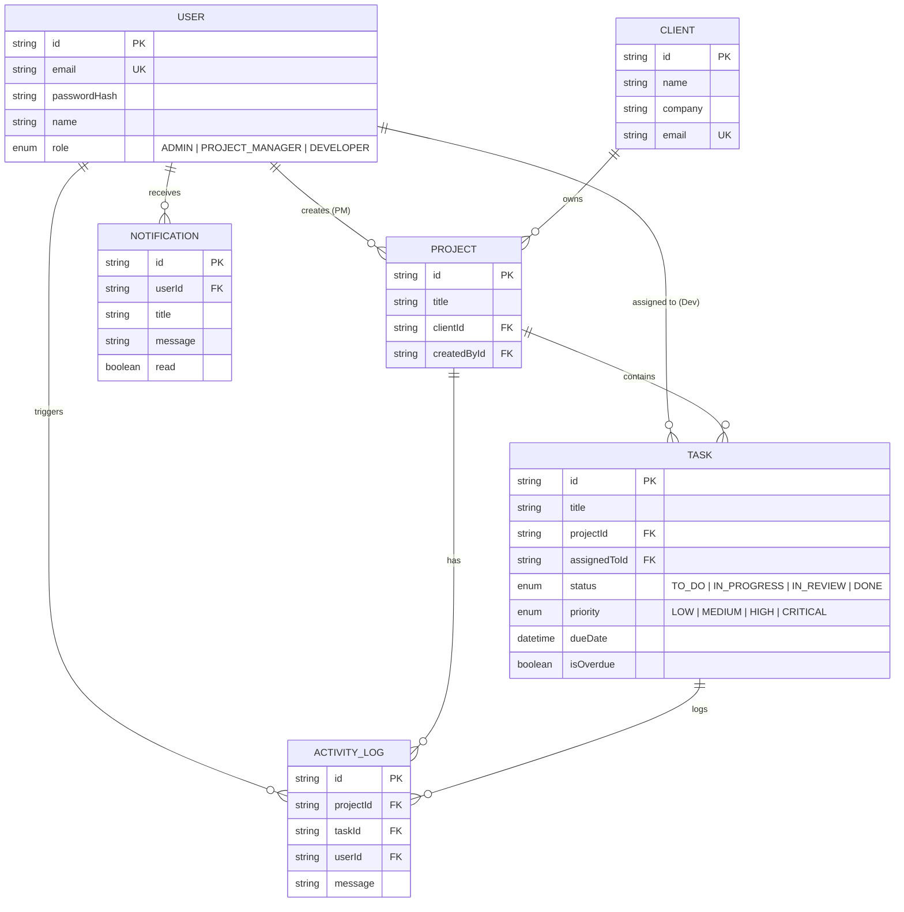

# NexusAgency - Real-Time Client Project Dashboard

A production-grade full-stack web application for agencies to manage client projects, track task progress, enforce strict Role-Based Access Control (RBAC), and monitor team activity via real-time WebSocket feeds and background task scheduling.

---

## 🚀 Technical Stack & Architecture

- **Frontend**: React 18 with TypeScript, Vite, Tailwind CSS, Lucide Icons, Socket.io-client.
- **Backend**: Node.js, Express, TypeScript, Socket.io, `node-cron`, JWT, Cookie Parser.
- **Database & ORM**: PostgreSQL with Prisma ORM.
- **Containerization**: Docker & Docker Compose.

---

## 🔑 Key Features & Role Access Matrix

| Feature | Admin | Project Manager (PM) | Developer |
| :--- | :--- | :--- | :--- |
| **Manage Clients** | Full Access | Full Access | No Access |
| **Manage Projects** | All Projects | Own Created Projects Only | View Assigned Projects Only |
| **Manage Tasks** | All Tasks | Own Projects' Tasks | View & Update Status of Assigned Tasks Only |
| **Activity Feed** | Global Activity (All) | PM's Projects Activity Only | Assigned Tasks Activity Only |
| **Dashboard Metrics**| Global Stats & Online Presence | Personal Projects & Tasks | Personal Task Queue |

### Security & Token Architecture
- **Access Tokens**: Short-lived (15 min) JWT sent in JSON response headers.
- **Refresh Tokens**: Long-lived (7 days) JWT stored in an **`HttpOnly` cookie** (`SameSite=Lax`, `Secure` in production).
- **Backend Role Middleware**: Enforced at the API route level on every request (e.g. `requireRole([Role.ADMIN, Role.PROJECT_MANAGER])` and `verifyProjectAccess`). Frontend role-hiding is backed by strict backend 403 Forbidden responses.

---

## 🛠 Architectural Decisions

### 1. WebSockets: Socket.io over Native WebSockets
We selected **Socket.io** because it provides built-in room abstractions (`global:activity`, `project:{id}`, `user:{id}`), automatic reconnection with exponential backoff, heartbeats, and client connection presence tracking. Handshakes are authenticated via JWT.

### 2. Job Queue / Scheduler: node-cron over Bull
We chose **`node-cron`** to execute in-process scheduled background checks every minute. This eliminates the operational overhead of running a dedicated Redis instance required by Bull, while reliably querying PostgreSQL for tasks where `dueDate < now` and `status != DONE`, flagging them `isOverdue = true`, recording activity logs, and emitting Socket.io events.

### 3. Database Schema & Indexing Decisions
PostgreSQL relational schema with strict foreign keys and strategic indexing:
- `Task(projectId)` & `Task(assignedToId)`: Accelerates project-level and developer-assigned task queries.
- `Task(dueDate, isOverdue)`: Optimizes background cron scanning for overdue tasks.
- `ActivityLog(projectId, createdAt)` & `ActivityLog(userId, createdAt)`: High-performance fetching of the last 20 activity events for offline catch-up.
- `Notification(userId, read)`: Instant lookup for unread notification count badges.

---

## 📊 Database Schema Description



---

## 🏃 Local Setup Instructions

### Option 1: Docker Compose (Recommended)
```bash
# 1. Clone the repository
git clone https://github.com/your-username/client-project-dashboard.git
cd client-project-dashboard

# 2. Copy environment file
cp .env.example .env

# 3. Launch PostgreSQL & App via Docker
docker-compose up --build -d

# App will be accessible at http://localhost:3000 (Frontend) & http://localhost:4000 (Backend)
```

### Option 2: Local Development Setup (Zero-Config SQLite or Postgres)
```bash
# 1. Install dependencies
npm install

# 2. Setup database and run seed script (Creates 7 Users, 3 Projects, 15 Tasks with 2 Overdue, Activity Logs)
npm run setup:local

# 3. Start concurrent development server (Backend + Frontend)
npm run dev:local
# Open http://localhost:3000 in your browser
```

---

## 📝 Seed Data Accounts (Password: `password123`)

| Role | Name | Email |
| :--- | :--- | :--- |
| **Admin** | Victoria Vance | `admin@agency.com` |
| **Project Manager** | Sarah Connor | `pm.sarah@agency.com` |
| **Project Manager** | Marcus Holloway | `pm.marcus@agency.com` |
| **Developer** | Ravi Kumar | `dev.ravi@agency.com` |
| **Developer** | Alex Mercer | `dev.alex@agency.com` |
| **Developer** | Elena Rostova | `dev.elena@agency.com` |
| **Developer** | Liam Vance | `dev.liam@agency.com` |

---

## ⚠️ Known Limitations

1. **In-Process Cron Job**: `node-cron` runs within the Express application process. For multi-instance horizontal scaling, a distributed job queue (like BullMQ with Redis) would prevent duplicate overdue job executions.
2. **Single Socket Node**: Socket.io connections are maintained in memory on a single server instance. Scaling horizontally across multiple servers requires a Redis Adapter or NGINX sticky sessions.
3. **Database Provider Migration**: SQLite is provided for zero-dependency local development (`npm run setup:local`), whereas PostgreSQL is configured for Docker Compose and production environments.

---

## 💡 Engineering Explanation & Hardest Problem Solved (150–250 Words)

> **The hardest problem solved** was architecting the real-time role-filtered activity feed and state recovery mechanism. Because users of different roles (Admin, PM, Developer) have strictly isolated data permissions, emitting a single global WebSocket event to all connected sockets would violate role security boundaries. We solved this by implementing Socket.io **Room Isolation**:
>
> - Admins join `global:activity`
> - PMs dynamically join `project:{id}` rooms for projects they own
> - Developers join `user:{userId}` and rooms for projects containing their assigned tasks
>
> When a task status transitions, the backend constructs an append-only `ActivityLog` DB entry and emits it targeted exclusively to the relevant project/user rooms. For offline recovery, when a user reconnects, the backend executes a role-scoped database query returning the last 20 events (`take: 20`), ensuring complete accuracy without relying on in-memory buffers.
>
> **One thing I'd do differently in the future** is introduce a Redis Pub/Sub backplane for horizontal scaling across multiple Node.js WebSocket instances, along with Optimistic UI updates on the Kanban task board to eliminate perceived network latency.
